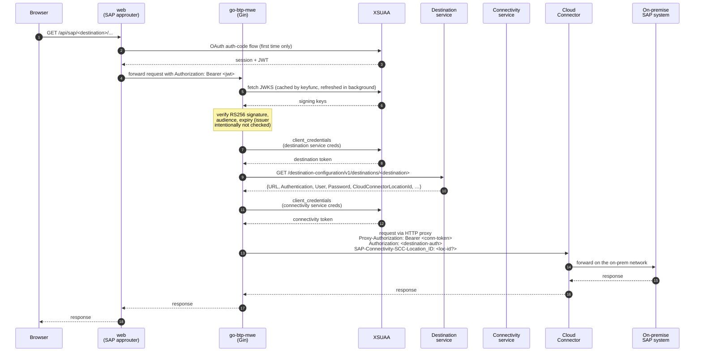

# go-sap-btp-cloud-foundry-mwe

A minimal working example of a Go webservice that:

- runs on **SAP BTP Cloud Foundry** (two apps: Go backend + SAP approuter),
- authenticates users via **XSUAA** (JWKS-pinned JWT validation: RS256 signature, audience, expiry — see `internal/btp/auth.go` for why issuer is intentionally not checked),
- calls an **on-premise SAP system** through the **Connectivity + Destination** services (the Cloud Connector three-leg dance),
- is built on **Gin** and structured for extension toward Auth0 / SSO / Principal Propagation without rewrites.

## Repository layout

```
cmd/server/main.go          Gin entry point; graceful shutdown; structured logs
internal/btp/
  env.go                    typed VCAP_SERVICES parsing + eager validation
  tokens.go                 XSUAA client-credentials fetcher (TTL cache, singleflight)
  destination.go            Destination-service lookup + typed AuthType/ProxyType
  proxy.go                  http.RoundTripper tunnelling via Connectivity proxy
  auth.go                   XSUAA JWT middleware (signature, aud, exp; see doc)
  authenticator.go          pluggable DestinationAuthenticator registry
  service.go                orchestrates the three-leg call + Gin pass-through
web/                        SAP approuter
  package.json              pulls @sap/approuter
  xs-app.json               routes /api/* to the Go backend destination
manifest.yml                two CF apps + service bindings (uses manifest vars)
xs-security.json            XSUAA app config
Procfile, .cfignore
vars.example.yml            template for cf push --vars-file vars.yml
```

## Using this repo as a template

All per-deployment string values (app name, Go module path, CF subaccount coordinates, service instance names) live in a single `config.yml` at the repo root. `cmd/apply-config` is a small Go tool that reads that file, type-checks every field, and rewrites the rest of the tree from it — `go.mod`, every Go import, `manifest.yml`, `xs-security.json`, `vars.example.yml`, `web/package.json`, and `.github/workflows/deploy.yml`.

Recommended flow after forking:

```sh
gh repo create my-org/my-app --template Hochfrequenz/go-sap-btp-cloud-foundry-mwe
cd my-app
$EDITOR config.yml                            # adjust app.name, app.module, cf.* etc.

go run ./cmd/apply-config --dry-run           # preview every planned change
go run ./cmd/apply-config                     # apply to the tree
go test ./...                                 # sanity check
git add -A && git commit -m "chore: configure fork"
```

Properties of the tool:

- **Typed.** `config.yml` is parsed into a Go struct with aggregated validation — all problems reported in one run, same pattern as `internal/btp/env.go`.
- **Idempotent.** Running twice with an unchanged `config.yml` is a no-op. CI can enforce that with `go run ./cmd/apply-config --check` (exit 1 if the tree drifts from the config).
- **Fails loudly.** Each file rewriter asserts its expected shape; a drifted target returns a clear error instead of silently producing garbage.
- **Zero internal dependencies.** The tool imports nothing from `internal/`, so it keeps working even while it's rewriting import paths.

`README.md` and `docs/btp-deploy-walkthrough.de.md` are **not** rewritten by the tool — they describe the original Hochfrequenz deployment and are meant to read as HF-flavoured prose. Strip or replace them in your fork as you see fit.

## Adding your service — the 80 % case

Building a new value-adding service that calls ABAP on an on-premise SAP system is **two anchors**: an ABAP endpoint on the SAP side, and a Gin handler on the Go side. The BTP plumbing between them (XSUAA login, Destination lookup, Cloud Connector tunnel, Basic Auth forwarding) is already wired up and you do not need to touch it.

### Anchor 1 — in the SAP system: the ABAP endpoint

Your ABAP developer (or you, with a pair of hands on SE80 / ADT) builds the endpoint.
Anything reachable by an ICF service node works: a RESTful handler at `/sap/bc/rest/<your-service>`, an ADT service at `/sap/bc/adt/...`, a SOAP envelope at `/sap/bc/soap/...`, a RAP service at `/sap/opu/odata4/sap/...`, whatever fits your logic.

Pin down, in SAP terms:

- the **URL path** inside the S/4 system (e.g. `/sap/bc/rest/zmy_invoice_sync`),
- the **authentication** your Destination in BTP cockpit uses (Basic Auth is the default; any technical user with the right authorization objects works),
- the **SAP authorization objects** needed to call it — those the technical user must hold.

One-time cockpit chore (covered in section 5c of "Post-deploy manual steps" below): create a **Destination** in the BTP subaccount pointing at that SAP system's virtual host on the Cloud Connector, with the technical user's credentials. From then on, every Go handler in this repo reaches the SAP side through that Destination by name.

### Anchor 2 — in this repo: the Gin handler

Open `cmd/server/main.go`. Routes live in `buildRouter`; the `api` group sits behind the XSUAA JWT middleware, so any `/api/*` route only reaches your handler after the caller's BTP login is validated.

```go
// In buildRouter, next to api.GET("/me", ...):
api.POST("/invoice-sync", invoiceSyncHandler(svc))
```

The handler itself — this is the whole pattern. Imports for this block: `"net/http"`, `"github.com/gin-gonic/gin"`, `"github.com/golang-jwt/jwt/v5"`, and `"<your-module>/internal/btp"`. The validation example in the next sub-section additionally needs `"time"`, `"encoding/json"`, and `"bytes"`.

```go
func invoiceSyncHandler(svc *btp.Service) gin.HandlerFunc {
    return func(c *gin.Context) {
        // Optional — inspect the authenticated user. Claims are already
        // signature- and audience-validated by the middleware. The
        // canonical XSUAA user claim is user_name; given_name,
        // family_name, email, scope, and xs.system.attributes.xs.rolecollections
        // are also available if the IdP released them.
        claims := c.MustGet("jwtClaims").(jwt.MapClaims)
        _ = claims["user_name"]

        // Call the on-prem SAP endpoint. svc.CallOnPremise runs the full
        // three-leg token dance, tunnels through the Cloud Connector, and
        // forwards with the Destination's configured Basic Auth.
        resp, err := svc.CallOnPremise(
            c.Request.Context(),
            "HF_S4",                              // Destination name from the cockpit; your fork names its own
            http.MethodPost,
            "/sap/bc/rest/zmy_invoice_sync",      // ABAP path from Anchor 1
            c.Request.Header,                     // forwarded minus Authorization, Cookie, Host
            c.Request.Body,                       // forwarded verbatim
        )
        if err != nil {
            c.JSON(http.StatusBadGateway, gin.H{"error": err.Error()})
            return
        }
        defer resp.Body.Close()

        // Stream or parse resp.Body however you like. DataFromReader
        // copies the body to the client verbatim, preserving status
        // code and content-type. resp.ContentLength can be -1 for
        // chunked responses; DataFromReader handles that correctly by
        // falling back to streaming without a Content-Length header.
        c.DataFromReader(resp.StatusCode, resp.ContentLength,
            resp.Header.Get("Content-Type"), resp.Body, nil)
    }
}
```

That's the whole wiring. For a pure pass-through (no pre/post-processing), the existing `/api/sap/:destination/*path` route already does exactly this — just compose the URL yourself on the caller side. **For anything that writes state on the SAP side, read the next sub-section first — do not ship the raw-body version.**

Unit-test the handler with the fixtures in `internal/btp/service_test.go`; they stand up stubs that respond like the real XSUAA / Destination / CC stack, so you can assert request shape and response translation without deploying.

### Validate and sanitise at the Gin layer, not in SAP

Sanitising a bad payload in ABAP is painful — data-type shaping is verbose, exception handling is heavy, and you cannot easily test an error path without a full transport-request round-trip. The same sanitising in Go is a struct tag and one line. Put the discipline as far to the left as possible.

Rule of thumb: **every byte that reaches `svc.CallOnPremise` has already passed type checks, required-field checks, format and range checks, and enum-value checks in the Gin handler**. If a request can fail validation, it fails here — with a `400` and a clear message — not on the SAP side with a Short Dump.

```go
type invoiceSyncRequest struct {
    CompanyCode string    `json:"company_code" binding:"required,len=4,uppercase"`
    PostingDate time.Time `json:"posting_date" binding:"required"`
    AmountCents int64     `json:"amount_cents" binding:"required,min=1"`
    Currency    string    `json:"currency"     binding:"required,oneof=EUR USD GBP"`
    Reference   string    `json:"reference"    binding:"max=16"`
}

func invoiceSyncHandler(svc *btp.Service) gin.HandlerFunc {
    return func(c *gin.Context) {
        var req invoiceSyncRequest
        if err := c.ShouldBindJSON(&req); err != nil {
            c.JSON(http.StatusBadRequest, gin.H{"error": err.Error()})
            return
        }
        // From here on, every field is typed and within contract. Only
        // after this line does the caller's payload deserve to see the
        // on-prem system.
        body, _ := json.Marshal(toABAPPayload(req))
        // ... svc.CallOnPremise(..., bytes.NewReader(body)) ...
    }
}
```

Gin's binding uses [`go-playground/validator`](https://github.com/go-playground/validator); the tag vocabulary covers required / length / regex / enum / cross-field rules (`required_with`, `gtfield`, etc.). For shape-checks beyond the tag language, add an explicit `Validate()` method on the request type and call it right after `ShouldBindJSON`.

Two things to apply the same discipline to, that are easy to forget:

- **Query and path parameters.** `c.ShouldBindQuery(&req)` and `c.ShouldBindUri(&req)` take the same struct-tag rules. Do not read raw `c.Query("amount")` and pass it on.
- **`interface{}` or `json.RawMessage` in a payload.** If the shape genuinely varies, wrap with a typed envelope that selects the variant, validate the envelope, then parse the raw field once the variant is known. An `interface{}` that travels to `svc.CallOnPremise` is a gift to SAP's Short-Dump generator.

### What you do NOT need to understand

The middleware and service code hide most of the BTP specifics. Unless you hit a bug or an edge, you can safely ignore:

- what XSUAA emits as `aud` and `iss` (the middleware validates signature, audience, expiry; invariants are in `internal/btp/auth.go`),
- how the three-leg token dance is sequenced (`internal/btp/service.go`),
- which headers `skipForwardedHeader` strips on forwarding (hop-by-hop, `Authorization`, `Cookie`, `Host` — the authenticator sets a fresh Authorization from the Destination),
- path-traversal defence — `Service.CallOnPremise` rejects `..` in the path suffix before anything leaves the process, so a handler can accept a path segment from the caller without building that check again itself.

If you do hit a wall, see "How it works under the hood" near the bottom of this README.

### When you need to look deeper

- **Your Destination uses Principal Propagation, not Basic Auth.** The approuter-forwarded user JWT is stashed in the request context under `btp.ForwardedUserTokenKey{}`; implement a `DestinationAuthenticator` that reads it and sets `SAP-Connectivity-Authentication`. See "Extension points" below.
- **Your on-prem endpoint needs CSRF tokens for writes** (most ADT writes do). See "What this MWE deliberately does *not* do" below — the MWE does not do the `x-csrf-token` handshake for you; wrap `Service.CallOnPremise` in an endpoint-specific handler that does the fetch-then-post two-step.
- **`/api/sap/...` returns 502 or an unexpected 401.** See the failure-mode ladder under "Smoke tests" below.

## Deployment

### Prerequisites

Before any `cf push` there are **three things a human has to do** in addition to having a Cloud Foundry CLI session:

#### 1. A Cloud Connector exposing the on-prem endpoint

A SAP Cloud Connector must be installed on the on-prem network, paired with your BTP subaccount, and must expose the internal SAP virtual host/port you want to reach. See [Install the Cloud Connector](https://help.sap.com/docs/connectivity/sap-btp-connectivity-cf/installation) and [Configure Access Control](https://help.sap.com/docs/connectivity/sap-btp-connectivity-cf/configure-access-control-http). Without this, the three-leg dance succeeds up to the final hop and then times out against a host that cannot be reached.

If your subaccount has more than one Cloud Connector, note each one's **Location ID** — you will set it on the Destination below as `CloudConnectorLocationId`.

#### 2. Three service instances

Create the XSUAA, Destination, and Connectivity instances with these **exact names** (referenced by `manifest.yml`):

```sh
cf create-service xsuaa application go-xsuaa -c xs-security.json
cf create-service destination lite    go-dest
cf create-service connectivity lite   go-cc
```

`cf push` (step 4 below) binds them to the app automatically via `manifest.yml`'s `services:` section.

#### 3. (First deploy only) Confirm which Go buildpack your landscape ships

This repo targets the classic `cloudfoundry/go-buildpack`, with `GO_INSTALL_PACKAGE_SPEC: ./cmd/server` set in `manifest.yml` so the buildpack knows where `main` lives (it does not auto-discover subpackages the way Paketo does). If `cf buildpacks` on your landscape shows `paketo-buildpacks/go` instead, replace the `buildpacks:` block with:

```yaml
buildpacks:
  - paketo-buildpacks/go
env:
  GIN_MODE: release
  BP_GO_TARGETS: ./cmd/server
```

Confirmed working on eu10 (AWS Frankfurt) with `go_buildpack` cflinuxfs4 v1.10.44 — [see the walkthrough](docs/btp-deploy-walkthrough.de.md) (DE) for the full replay.

### Pre-flight gotchas

Compiled from the first real deploy on SAP's `eu10` landscape in April 2026.
Two conventions to keep in mind while reading this section:

- `<angle-brackets>` mark values you substitute for your own deploy — they are reusable patterns.
- `` `backticks on specific strings` `` mark the concrete values I used on Hochfrequenz's subaccount (e.g. `eu10`, `go-btp-mwe`, `go_buildpack cflinuxfs4 v1.10.44`), shown for illustration only — change them for yours.

1. **Org-level route quota, not space-level.**
   `cf routes` only lists the currently-targeted space, but the route quota is an **org-wide** limit.
   Before `cf push`, confirm at least **two** free route slots (one per app — backend + approuter):

   ```sh
   # Set this to the name shown under "org:" in 'cf target' (HF example: "HF Dev Account_hf-cf"):
   ORG="<your-cf-org-name>"

   ORG_GUID=$(cf org "$ORG" --guid)
   QUOTA_GUID=$(cf curl "/v3/organizations/$ORG_GUID" | jq -r .relationships.quota.data.guid)

   echo "Used:  $(cf curl "/v3/routes?per_page=100&organization_guids=$ORG_GUID" | jq .pagination.total_results)"
   echo "Quota: $(cf curl "/v3/organization_quotas/$QUOTA_GUID"                  | jq .routes.total_routes)"
   ```

   If you're within 2 of the quota, either free slots by removing a stopped app with its routes (`cf delete <app-name> -r -f` — note that `-r` can free *more* slots than `cf routes` in the current space suggested, because orphan routes from other spaces travel with the app), or ask a global-account admin to raise the quota.
   Symptom when ignored: `Routes quota exceeded for organization '<org>'`, raised before staging begins.

2. **SAP's `go_buildpack` lags upstream Go.**
   On `eu10` as of April 2026 the buildpack `go_buildpack` cflinuxfs4 v1.10.44 installs **Go 1.23.12**, which has gone out of support since Go 1.26 was released.
   Our `go.mod` declares `go 1.26`, and staging still succeeds on `eu10` — because Go's auto-toolchain feature fetches the newer toolchain over the network when the stager allows egress.
   If your landscape blocks egress from build containers, the stager will fail with `go.mod requires go >= 1.26 (running go 1.23.12)` instead.
   Do not assume post-1.23 language or stdlib features will work in production without testing first.

3. **The cockpit steps in section 5b + 5c below require subaccount admin rights.**
   Creating a Role Collection and creating a Destination are both blocked for a plain Space Developer.
   A `cf push` will succeed and then stall on permissions when you try to click through the cockpit.
   Check with whoever administers your subaccount before starting.

4. **The cockpit URL pattern you may remember has changed in some regions.**
   The historical `https://cockpit.<region>.hana.ondemand.com/` pattern has been replaced — e.g. EMEA is now at `https://emea.cockpit.btp.cloud.sap/cockpit`.
   The stable portable entry is `https://account.hana.ondemand.com/`, which redirects to whichever regional cockpit your user belongs to.

5. **Windows-only: winget quirks for the CF CLI (skip if not on Windows).**
   The correct winget package ID is `CloudFoundry.CLI.v8` (or `.v7` for the previous major).
   `CloudFoundry.CloudFoundryCLI` — a plausible-looking ID — does **not** exist and `winget install` will refuse it.
   After `winget install`, close and reopen your terminal before running `cf`; already-open shells keep their old `PATH` and will report `cf: command not found` even though the binary is installed.

### 4. cf push

```sh
cp vars.example.yml vars.yml    # edit for your subaccount domain
cf push -f manifest.yml --vars-file vars.yml
```

`vars.example.yml` contains:

```yaml
backend-host: go-btp-mwe
domain: cfapps.eu10.hana.ondemand.com
```

### 5. Post-deploy manual steps (required for the app to work)

Even after a green `cf push`, **three things still need to be done by a human in the BTP cockpit** before requests succeed:

#### 5a. Update XSUAA redirect URIs

The shipped `xs-security.json` has an empty `redirect-uris` array — we cannot know the approuter's URL until the first push. After deploy:

1. Find the approuter route: `cf app go-btp-mwe-web` (it prints the `routes:` — note the HTTPS URL).
2. Edit `xs-security.json` and add `"https://<approuter-host>.<domain>/**"` to `oauth2-configuration.redirect-uris`.
3. Push the updated security config: `cf update-service go-xsuaa -c xs-security.json`.
4. **Immediately run `git restore xs-security.json`** so your deploy-specific URL doesn't end up in a commit. `redirect-uris` lives inside XSUAA now; the file in the repo stays empty by convention, one edit per deploy, never committed.

Skipping this yields "redirect URI mismatch" on the first OAuth login.

#### 5b. Create a Role Collection and assign it to yourself

`xs-security.json` defines a `User` role template. XSUAA issues tokens without scopes until a Role Collection containing that role is assigned to your BTP user.

1. BTP cockpit → your subaccount → Security → **Role Collections** → Create.
2. Name it e.g. `go-btp-mwe-users`, add the role template `User` under `go-btp-mwe`.
3. Security → **Users** → your user → add the new Role Collection.
4. If you were already logged in through the approuter, log out (`/logout`) and back in so the new token carries the scope.

The `/api/*` routes this MWE ships with do **not** enforce the `User` scope — the JWT middleware only validates signature, audience, and expiry, so a valid XSUAA user passes regardless of Role Collection. 5b matters the moment you add a scope-gated route (e.g. `c.MustGet("jwtClaims")` then checking `scope` contains `User`); without 5b, that route would 403 even though login succeeds.

#### 5c. Create a Destination pointing at your on-prem system

BTP cockpit → subaccount → Connectivity → **Destinations** → New Destination:

| Field | Value |
| --- | --- |
| **Name** | `HfSap` (whatever you plan to reference in `/api/sap/<name>/…`) |
| **Type** | `HTTP` |
| **URL** | virtual host as exposed by the Cloud Connector (e.g. `http://hfsap.cc:8000`) |
| **Proxy Type** | `OnPremise` |
| **Authentication** | `BasicAuthentication` (or `NoAuthentication` for a smoke-test endpoint) |
| **User / Password** | the SAP account on the on-prem system |
| **Additional Properties** (optional) | `CloudConnectorLocationId` = `<your location ID>` if you have multiple CCs |

Once this exists, `https://<approuter-host>.<domain>/api/sap/HfSap/<path>` will work. Until it does, `/api/sap/HfSap/...` returns 502 from the Go backend.

### 6. Smoke tests

Run the three checks in order. If one fails, the earlier ones still isolate where in the chain things broke.

Substitute `<approuter-host>` and `<domain>` for your deploy (from step 3 — typically `go-btp-mwe-web` and e.g. `cfapps.eu10.hana.ondemand.com`).

#### 6a. `/healthz` — approuter reaches the Go backend

```sh
curl -i https://<approuter-host>.<domain>/healthz
```

Expected: `HTTP/1.1 200 OK` with body `ok`. `/healthz` is explicitly marked `authenticationType: none` in `web/xs-app.json`, so this proves the approuter is up and forwarding without needing auth. If this fails, the approuter or backend didn't start — check `cf app <backend-host>` and `cf app <approuter-host>`.

#### 6b. `/api/me` — full OAuth + JWT-validation chain

Open in a browser — `curl` alone cannot complete the XSUAA SSO dance. Use whatever your OS opens HTTPS URLs with (`open` on macOS, `start` on Windows cmd, `xdg-open` on Linux), or paste the URL:

```
https://<approuter-host>.<domain>/api/me
```

Expected: a JSON body with a `claims` object — your `email`, `given_name`, `family_name`, `scope`, and `xs.system.attributes.xs.rolecollections`. This exercises the approuter's XSUAA auth-code flow, the Go backend's JWKS-pinned signature verification, and the `aud` / exp / leeway checks in `internal/btp/auth.go`.

A `401 invalid token: ... invalid audience` here points at section 7 of this deployment's tracking issue — XSUAA emits `aud` in the `sb-<xsappname>!t<tenant>` (`ClientID`) form, not bare `<xsappname>`.

#### 6c. `/api/sap/<destination-name>/sap/bc/adt/discovery` — full three-leg call to on-prem

Simplest: open the URL in the same browser you used for 6b — the approuter session cookie is already set, and the browser will offer the XML body as a download. A 23 KB `*.xml` download is the success signal.

If you want `curl` instead, export the approuter session cookie from your browser (DevTools → Application → Cookies → copy `JSESSIONID`, or use a "cookies.txt" browser extension) and pass it via `-b`:

```sh
curl -L -b "JSESSIONID=<value-from-devtools>" \
  https://<approuter-host>.<domain>/api/sap/<destination-name>/sap/bc/adt/discovery
```

Expected: `200 application/atomsvc+xml` with a body starting `<?xml version="1.0" ... <app:service ...>`. That one call exercises the destination-service lookup, both XSUAA `client_credentials` fetches, the Cloud Connector proxy tunnel, and Basic Auth against the on-premise SAP system — in the three-leg sequence described in the architecture diagram above.

Why `/sap/bc/adt/discovery` as the probe: it's a standard ABAP Development Tools endpoint (used by [`Hochfrequenz/adtler`](https://github.com/Hochfrequenz/adtler) as the CSRF-preflight target), available on any ADT-enabled S/4 system, and reachable by any authenticated ADT developer user — so it rarely trips on fine-grained authorization. If your destination points at a non-S/4 system (for example a HANA XS-only host), substitute an endpoint your destination user has read access to.

Common failure modes, in the order they get more annoying to diagnose:

- `404` from the approuter: the backend isn't bound to the destination `GoBackend` that `web/xs-app.json` references, or the backend crashed. `cf logs <backend-host> --recent`.
- `401 invalid audience` or `... invalid issuer`: section 7. The JWT middleware expects a token shape XSUAA does not emit. Fix is in `internal/btp/auth.go`.
- `502` from the Go backend: the destination lookup succeeded but the on-premise call failed. Most common causes: the destination's virtual host is not exposed by the Cloud Connector, or the Cloud Connector is red.
- `403` with an SAP-branded body: the destination's stored user authenticated successfully but does not have authorization for the path you chose. Switch the path, not the destination.

## Continuous deployment

`.github/workflows/deploy.yml` deploys both apps on every **published GitHub Release** (not on push-to-main, not on plain tag pushes — only the explicit "Publish release" click). The workflow has two jobs:

1. **`gate`** — `go vet`, `go test ./... -race`, `golangci-lint`, `gofmt --diff`. All four must pass green.
2. **`deploy`** — only runs if `gate` was green. Cross-compiles a static Linux binary on the runner, installs `cf` v8, pushes backend via `binary_buildpack -c './bin/server'` (bypassing the stager-side Go compile which OOMs on `eu10` — see "Pre-flight gotchas" above), pushes the approuter via the manifest's `nodejs_buildpack`, then curls `/healthz` and fails the workflow if it isn't `200 ok`.

### Required repository secrets

| Secret | What it is |
| --- | --- |
| `CF_USER` | Email of a CF user with the `SpaceDeveloper` role on the deploy target space. See the caveat below — this usually needs to be a **technical user** created by a Subaccount Administrator, because SSO-only users cannot authenticate non-interactively. |
| `CF_PASSWORD` | That user's password. |

Set both at **Settings → Secrets and variables → Actions → New repository secret**. If either is missing, the deploy job fails loudly at `cf auth` instead of silently pushing with empty credentials.

### Caveat on CF identity

BTP subaccounts commonly enforce SAP ID Service SSO for human users, which means those users have **no usable password** for `cf login -u/-p`. The workflow needs a non-interactive credential pair, which usually means creating a dedicated CF user ("technical user") via **BTP cockpit → Security → Users → New** with a local password, then granting `SpaceDeveloper` on the target space via `cf set-space-role`. Creating the user requires Subaccount Administrator rights.

The alternative — `cf login --sso` with a temporary passcode — is interactive-only and not suitable for CI.

### What the manifest does vs. what CI overrides

The committed `manifest.yml` still declares `buildpacks: [go_buildpack]` so a manual `cf push` from a laptop keeps working as documented. The CD workflow explicitly overrides that with `-b binary_buildpack -c './bin/server'` because classic `go_buildpack` on `eu10` OOMs while compiling the Go 1.26 toolchain against the full dependency tree, and the org-level memory quota is too tight to grow the backend's `memory:` to give the stager enough RAM. Long-term: switch the manifest default to `binary_buildpack` and commit that change once the rest of the team is ready to rebuild locally before pushing manually.

## Local development

**The server refuses to start without `VCAP_APPLICATION` and `VCAP_SERVICES`.**
That is deliberate: there is no meaningful "just run it" mode for a BTP-integrated app, and the alternative (stubbing each service) leads to code paths that only ever run on a developer laptop.

The recommended feedback loop is the unit test suite:

```sh
go test ./... -race
go test ./... -covermode=count -coverprofile=coverage.out
```

CI enforces 90% line coverage (`.github/workflows/coverage.yml`).

If you need to exercise Gin handlers against real (stub) BTP services locally, set the env explicitly. The required shape matches `internal/btp/env.go` struct tags:

```sh
export VCAP_APPLICATION='{"application_id":"x","application_name":"go-btp-mwe","space_name":"dev","uris":["localhost"]}'
export VCAP_SERVICES='{
  "xsuaa":[{"label":"xsuaa","name":"go-xsuaa","credentials":{
    "url":"https://your-stub","clientid":"cid","clientsecret":"csec",
    "xsappname":"go-btp-mwe","uaadomain":"your-stub","identityzone":"dev"}}],
  "destination":[{"label":"destination","name":"go-dest","credentials":{
    "uri":"https://your-dest-stub","clientid":"d","clientsecret":"ds","url":"https://your-stub"}}],
  "connectivity":[{"label":"connectivity","name":"go-cc","credentials":{
    "clientid":"c","clientsecret":"cs","url":"https://your-stub",
    "onpremise_proxy_host":"127.0.0.1","onpremise_proxy_port":"20003"}}]
}'
go run ./cmd/server
```

A broken `VCAP_SERVICES` payload produces a single error listing **all** problems at once — modeled on [Hochfrequenz/sap-mcp-config](https://github.com/Hochfrequenz/sap-mcp-config). No more "fix one field, redeploy, find the next missing field."

## Extension points

The primary extension surface is `btp.DestinationAuthenticator`:

```go
type DestinationAuthenticator interface {
    AuthType() AuthType
    Apply(ctx context.Context, req *http.Request, dest *Destination) error
}
```

Register more at startup without touching the call site:

```go
svc, _ := btp.NewService(env)
svc.Authenticators().Register(myAuth0Authenticator{})
svc.Authenticators().Register(myOAuth2ClientCredsAuthenticator{})
```

Shipped out of the box: `AuthNone` and `AuthBasic`, plus a rejecting fallback so unknown auth types fail loudly rather than travelling unauthenticated. The authenticator registry is where Auth0/SSO/`OAuth2ClientCredentials`/`PrincipalPropagation` plug in.

For Principal Propagation specifically: the approuter-forwarded user JWT is stashed in the request context under `btp.ForwardedUserTokenKey{}` — a PP authenticator reads it from there and sets `SAP-Connectivity-Authentication`.

## What this MWE deliberately does *not* do

- **No fake `Mozilla/5.0` User-Agent.** The PHP/Python reference impersonates a browser as a HF-SAP workaround; the SAP BTP spec has no such requirement.
- **No local-dev mock layer.** Stubbing VCAP is documented above; writing mocks into the code is where drift starts.
- **No CSRF / `x-csrf-token` handshake.** If your on-prem endpoint needs it, wrap `Service.CallOnPremise` in an endpoint-specific handler that does the fetch-then-post two-step.
- **No destination-service caching.** Destinations change rarely but we re-fetch on every request for now; add a TTL cache once there is a reason to.

## How it works under the hood

You do not need this section to write a handler. It is here for when a deploy misbehaves, a token doesn't validate, or you want to understand what `svc.CallOnPremise` actually does on the wire.

Two CF applications share one XSUAA instance. The approuter is the browser-facing front door; the Go backend is the thing that actually talks to the on-premise SAP system. The Destination and Connectivity services are bound only to the backend.



XSUAA client-credentials tokens are cached with a 30 s refresh leeway and collapsed via singleflight so a burst of concurrent requests does not hammer XSUAA. A `401` from the on-prem system on a GET-style (body-less) call invalidates the cached connectivity token and retries once, so mid-flight token expiry self-heals instead of bubbling up; a `403` is **not** retried (that means "authenticated but not authorized", which a fresh token cannot fix).

## References

- [SAP BTP Connectivity & Destination (Help Portal)](https://help.sap.com/docs/connectivity/sap-btp-connectivity-cf)
- [SAP Cloud Connector install guide](https://help.sap.com/docs/connectivity/sap-btp-connectivity-cf/installation)
- [Destination service REST API](https://help.sap.com/docs/connectivity/sap-btp-connectivity-cf/destinations-destination-service-rest-api) — `/destination-configuration/v1/destinations/{name}` is the generic lookup this MWE uses
- [SAP Cloud SDK (JS) — on-premise connectivity headers](https://sap.github.io/cloud-sdk/docs/js/features/connectivity/on-premise)
- [BTP-Python-Template](https://github.com/Hochfrequenz/BTP-Python-Template) — the Python analogue
- [sap-mcp-config](https://github.com/Hochfrequenz/sap-mcp-config) — source of the eager-validation pattern used in `env.go`
