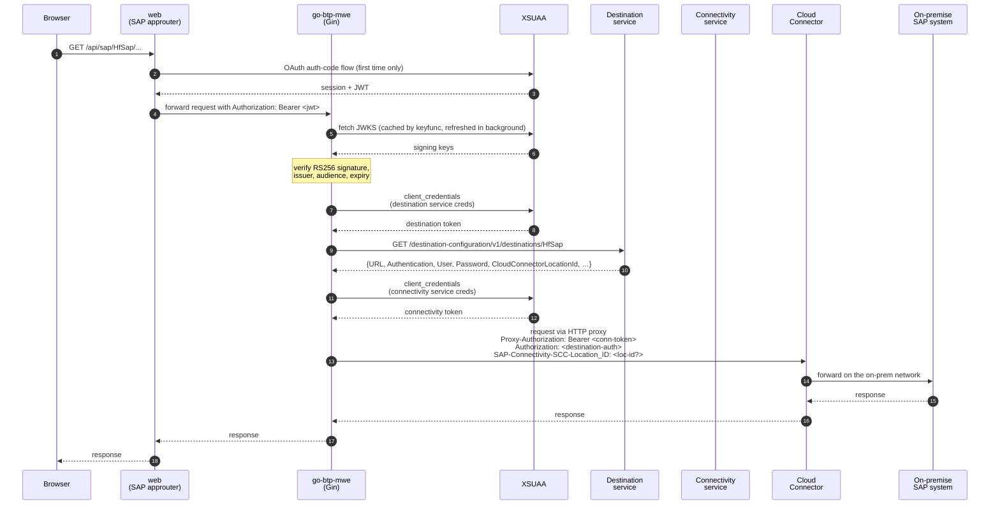

# go-sap-btp-cloud-foundry-mwe

A minimal working example of a Go webservice that:

- runs on **SAP BTP Cloud Foundry** (two apps: Go backend + SAP approuter),
- authenticates users via **XSUAA** (full JWKS-based JWT validation: signature, issuer, audience, expiry),
- calls an **on-premise SAP system** through the **Connectivity + Destination** services (the Cloud Connector three-leg dance),
- is built on **Gin** and structured for extension toward Auth0 / SSO / Principal Propagation without rewrites.

## Architecture

Two CF applications share one XSUAA instance. The approuter is the browser-facing front door; the Go backend is the thing that actually talks to the on-premise SAP system. The Destination and Connectivity services are bound only to the backend.



XSUAA client-credentials tokens are cached with a 30 s refresh leeway and collapsed via singleflight so a burst of concurrent requests does not hammer XSUAA. A 401/403 from the on-prem system invalidates the cached connectivity token and retries once (when the request body is replayable), so mid-flight token expiry self-heals instead of bubbling up.

## Repository layout

```
cmd/server/main.go          Gin entry point; graceful shutdown; structured logs
internal/btp/
  env.go                    typed VCAP_SERVICES parsing + eager validation
  tokens.go                 XSUAA client-credentials fetcher (TTL cache, singleflight)
  destination.go            Destination-service lookup + typed AuthType/ProxyType
  proxy.go                  http.RoundTripper tunnelling via Connectivity proxy
  auth.go                   XSUAA JWT middleware (signature, iss, aud, exp)
  authenticator.go          pluggable DestinationAuthenticator registry
  service.go                orchestrates the three-leg call + Gin pass-through
web/                        SAP approuter
  package.json              pulls @sap/approuter
  xs-app.json               routes /api/* to the Go backend destination
manifest.yml                two CF apps + service bindings (uses manifest vars)
xs-security.json            XSUAA app config
Procfile, .cfignore
vars.example.yml            template for cf push --vars-file vars.yml
```

## Deployment

### Prerequisites

Before any `cf push` there are **three things a human has to do** in addition to having a Cloud Foundry CLI session:

#### 1. A Cloud Connector exposing the on-prem endpoint

A SAP Cloud Connector must be installed on the on-prem network, paired with your BTP subaccount, and must expose the internal SAP virtual host/port you want to reach. See [Install the Cloud Connector](https://help.sap.com/docs/connectivity/sap-btp-connectivity-cf/installation) and [Configure Access Control](https://help.sap.com/docs/connectivity/sap-btp-connectivity-cf/configure-access-control-http). Without this, the three-leg dance succeeds up to the final hop and then times out against a host that cannot be reached.

If your subaccount has more than one Cloud Connector, note each one's **Location ID** — you will set it on the Destination below as `CloudConnectorLocationId`.

#### 2. Three service instances

Create the XSUAA, Destination, and Connectivity instances with these **exact names** (referenced by `manifest.yml`):

```sh
cf create-service xsuaa application go-xsuaa -c xs-security.json
cf create-service destination lite    go-dest
cf create-service connectivity lite   go-cc
```

`cf push` (step 4 below) binds them to the app automatically via `manifest.yml`'s `services:` section.

#### 3. (First deploy only) Confirm which Go buildpack your landscape ships

This repo targets the classic `cloudfoundry/go-buildpack`, with `GO_INSTALL_PACKAGE_SPEC: ./cmd/server` set in `manifest.yml` so the buildpack knows where `main` lives (it does not auto-discover subpackages the way Paketo does). If `cf buildpacks` on your landscape shows `paketo-buildpacks/go` instead, replace the `buildpacks:` block with:

```yaml
buildpacks:
  - paketo-buildpacks/go
env:
  GIN_MODE: release
  BP_GO_TARGETS: ./cmd/server
```

Confirmed working on eu10 (AWS Frankfurt) with `go_buildpack` cflinuxfs4 v1.10.44 — [see the walkthrough](docs/btp-deploy-walkthrough.de.md) (DE) for the full replay.

### Pre-flight gotchas (`eu10`, April 2026)

Things that bit the first real deploy and are worth a 10-second check before `cf push`:

1. **Org-level route quota, not space-level.** `cf routes` only shows the current space, but the route quota applies org-wide. Check:

   ```sh
   cf curl "/v3/routes?per_page=100&organization_guids=$(cf org "$ORG" --guid)" \
     | jq .pagination.total_results
   cf curl "/v3/organization_quotas/$(cf org "$ORG" --guid \
     | xargs -I{} cf curl /v3/organizations/{} \
     | jq -r .relationships.quota.data.guid)" | jq .routes
   ```

   The push needs **two** free route slots (backend + approuter). If you're within 2 of the quota, free some slots (`cf delete <stopped-app> -r`) or ask a global-account admin to raise the quota. Symptom when ignored: `Routes quota exceeded for organization '…'`, before staging starts.

2. **Buildpack Go version is not current.** SAP's `go_buildpack` lags upstream. On eu10 today it ships Go 1.23.12 (EOL since Go 1.26 released), even though `go.mod` says `go 1.26`. The build works as long as the stager can fetch a newer toolchain via Go's auto-toolchain feature — if it can't, the build fails with `go.mod requires go >= 1.26`. Don't start using post-1.23 language/stdlib features without testing against the landscape first.

3. **Sections 5b + 5c below need subaccount admin rights.** If your BTP user is a plain Space Developer (typical non-admin), creating a Role Collection and a Destination are blocked by the cockpit. Check with whoever admins `HF CloudFoundry` before you start; otherwise you'll `cf push` successfully and then stall on permissions.

4. **Cockpit URLs have moved.** The historical `https://cockpit.<region>.hana.ondemand.com/` pattern now redirects; the current EMEA entry is `https://emea.cockpit.btp.cloud.sap/cockpit`. The stable way to land in the right place is `https://account.hana.ondemand.com/`, which redirects to your regional cockpit automatically.

### 4. cf push

```sh
cp vars.example.yml vars.yml    # edit for your subaccount domain
cf push -f manifest.yml --vars-file vars.yml
```

`vars.example.yml` contains:

```yaml
backend-host: go-btp-mwe
domain: cfapps.eu10.hana.ondemand.com
```

### 5. Post-deploy manual steps (required for the app to work)

Even after a green `cf push`, **three things still need to be done by a human in the BTP cockpit** before requests succeed:

#### 5a. Update XSUAA redirect URIs

The shipped `xs-security.json` has an empty `redirect-uris` array — we cannot know the approuter's URL until the first push. After deploy:

1. Find the approuter route: `cf app go-btp-mwe-web` (it prints the `routes:` — note the HTTPS URL).
2. Edit `xs-security.json` and add `"https://<approuter-host>.<domain>/**"` to `oauth2-configuration.redirect-uris`.
3. Push the updated security config: `cf update-service go-xsuaa -c xs-security.json`.

Skipping this yields "redirect URI mismatch" on the first OAuth login.

#### 5b. Create a Role Collection and assign it to yourself

`xs-security.json` defines a `User` role template. XSUAA issues tokens without scopes until a Role Collection containing that role is assigned to your BTP user.

1. BTP cockpit → your subaccount → Security → **Role Collections** → Create.
2. Name it e.g. `go-btp-mwe-users`, add the role template `User` under `go-btp-mwe`.
3. Security → **Users** → your user → add the new Role Collection.
4. If you were already logged in through the approuter, log out (`/logout`) and back in so the new token carries the scope.

Skipping this yields HTTP 403 from `/api/*` even though login succeeds.

#### 5c. Create a Destination pointing at your on-prem system

BTP cockpit → subaccount → Connectivity → **Destinations** → New Destination:

| Field | Value |
| --- | --- |
| **Name** | `HfSap` (whatever you plan to reference in `/api/sap/<name>/…`) |
| **Type** | `HTTP` |
| **URL** | virtual host as exposed by the Cloud Connector (e.g. `http://hfsap.cc:8000`) |
| **Proxy Type** | `OnPremise` |
| **Authentication** | `BasicAuthentication` (or `NoAuthentication` for a smoke-test endpoint) |
| **User / Password** | the SAP account on the on-prem system |
| **Additional Properties** (optional) | `CloudConnectorLocationId` = `<your location ID>` if you have multiple CCs |

Once this exists, `https://<approuter-host>.<domain>/api/sap/HfSap/<path>` will work. Until it does, `/api/sap/HfSap/...` returns 502 from the Go backend.

### 6. Smoke test

```sh
# The approuter will bounce you through XSUAA login in a browser the first time.
curl -L https://<approuter-host>.<domain>/api/me
```

`/api/me` echoes the validated JWT claims — handy to verify 5a + 5b before moving on to 5c.

## Local development

**The server refuses to start without `VCAP_APPLICATION` and `VCAP_SERVICES`.**
That is deliberate: there is no meaningful "just run it" mode for a BTP-integrated app, and the alternative (stubbing each service) leads to code paths that only ever run on a developer laptop.

The recommended feedback loop is the unit test suite:

```sh
go test ./... -race
go test ./... -covermode=count -coverprofile=coverage.out
```

CI enforces 90% line coverage (`.github/workflows/coverage.yml`).

If you need to exercise Gin handlers against real (stub) BTP services locally, set the env explicitly. The required shape matches `internal/btp/env.go` struct tags:

```sh
export VCAP_APPLICATION='{"application_id":"x","application_name":"go-btp-mwe","space_name":"dev","uris":["localhost"]}'
export VCAP_SERVICES='{
  "xsuaa":[{"label":"xsuaa","name":"go-xsuaa","credentials":{
    "url":"https://your-stub","clientid":"cid","clientsecret":"csec",
    "xsappname":"go-btp-mwe","uaadomain":"your-stub","identityzone":"dev"}}],
  "destination":[{"label":"destination","name":"go-dest","credentials":{
    "uri":"https://your-dest-stub","clientid":"d","clientsecret":"ds","url":"https://your-stub"}}],
  "connectivity":[{"label":"connectivity","name":"go-cc","credentials":{
    "clientid":"c","clientsecret":"cs","url":"https://your-stub",
    "onpremise_proxy_host":"127.0.0.1","onpremise_proxy_port":"20003"}}]
}'
go run ./cmd/server
```

A broken `VCAP_SERVICES` payload produces a single error listing **all** problems at once — modeled on [Hochfrequenz/sap-mcp-config](https://github.com/Hochfrequenz/sap-mcp-config). No more "fix one field, redeploy, find the next missing field."

## Extension points

The primary extension surface is `btp.DestinationAuthenticator`:

```go
type DestinationAuthenticator interface {
    AuthType() AuthType
    Apply(ctx context.Context, req *http.Request, dest *Destination) error
}
```

Register more at startup without touching the call site:

```go
svc, _ := btp.NewService(env)
svc.Authenticators().Register(myAuth0Authenticator{})
svc.Authenticators().Register(myOAuth2ClientCredsAuthenticator{})
```

Shipped out of the box: `AuthNone` and `AuthBasic`, plus a rejecting fallback so unknown auth types fail loudly rather than travelling unauthenticated. The authenticator registry is where Auth0/SSO/`OAuth2ClientCredentials`/`PrincipalPropagation` plug in.

For Principal Propagation specifically: the approuter-forwarded user JWT is stashed in the request context under `btp.ForwardedUserTokenKey{}` — a PP authenticator reads it from there and sets `SAP-Connectivity-Authentication`.

## What this MWE deliberately does *not* do

- **No fake `Mozilla/5.0` User-Agent.** The PHP/Python reference impersonates a browser as a HF-SAP workaround; the SAP BTP spec has no such requirement.
- **No local-dev mock layer.** Stubbing VCAP is documented above; writing mocks into the code is where drift starts.
- **No CSRF / `x-csrf-token` handshake.** If your on-prem endpoint needs it, wrap `Service.CallOnPremise` in an endpoint-specific handler that does the fetch-then-post two-step.
- **No destination-service caching.** Destinations change rarely but we re-fetch on every request for now; add a TTL cache once there is a reason to.

## References

- [SAP BTP Connectivity & Destination (Help Portal)](https://help.sap.com/docs/connectivity/sap-btp-connectivity-cf)
- [SAP Cloud Connector install guide](https://help.sap.com/docs/connectivity/sap-btp-connectivity-cf/installation)
- [Destination service REST API](https://help.sap.com/docs/connectivity/sap-btp-connectivity-cf/destinations-destination-service-rest-api) — `/destination-configuration/v1/destinations/{name}` is the generic lookup this MWE uses
- [SAP Cloud SDK (JS) — on-premise connectivity headers](https://sap.github.io/cloud-sdk/docs/js/features/connectivity/on-premise)
- [BTP-Python-Template](https://github.com/Hochfrequenz/BTP-Python-Template) — the Python analogue
- [sap-mcp-config](https://github.com/Hochfrequenz/sap-mcp-config) — source of the eager-validation pattern used in `env.go`
